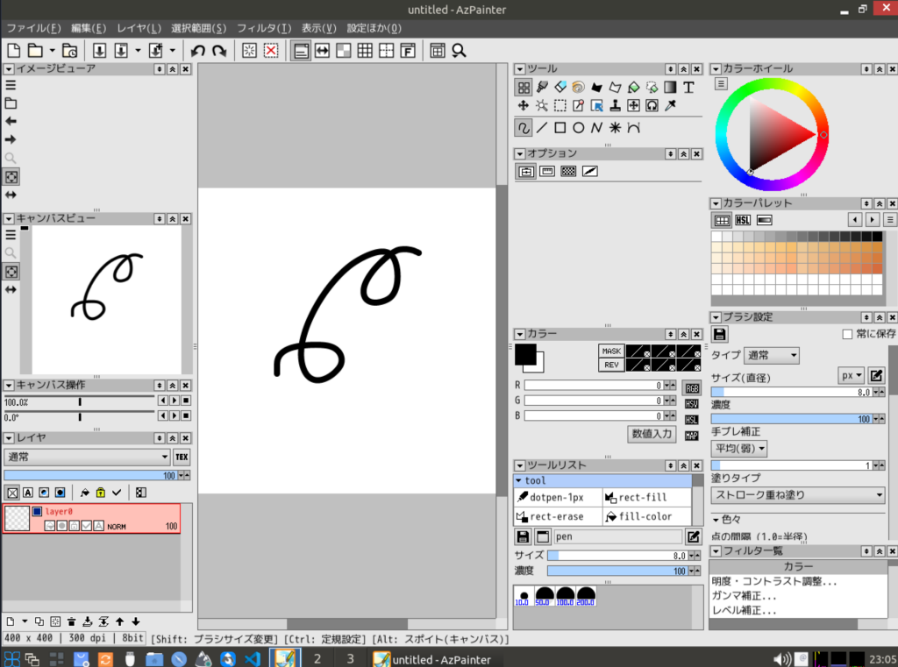

# antix-azpainter

antiX 向け [AzPainter](https://gitlab.com/azelpg/azpainter) のビルド済みパッケージ・インストールスクリプト集です。

AzPainter は Debian 公式リポジトリに存在しないため、これまでソースからビルドする必要がありました。
このリポジトリでは、ビルド済みのバイナリを GitHub Releases からダウンロードしてインストールできます。



## ファイル構成

| ファイル | 説明 |
| --- | --- |
| `install-azpainter.sh` | GitHub Releases からビルド済みパッケージをダウンロードしてインストール |
| `uninstall-azpainter.sh` | インストールした AzPainter をアンインストール |
| `make-release.sh` | インストール済みのファイルをリリース用 tarball にパッケージング |
| `antix-install-azpainter.sh` | ソースからビルドする従来のスクリプト（代替手段） |

## インストール（ビルド済みパッケージ）

インストール先は `/usr/local` です。root 権限が必要です。

```sh
# スクリプトを取得
wget https://github.com/hirogura/antix-azpainter/raw/main/install-azpainter.sh

# 実行
chmod +x install-azpainter.sh
sudo ./install-azpainter.sh
```

スクリプトは実行時に「最新リリース」の tarball
（`azpainter-linux-<arch>.tar.gz`、x86_64 / aarch64 対応）をダウンロードして展開します。
不足している依存ライブラリがあれば自動で `apt` からインストールします。

インストールが完了すると、デスクトップメニューまたは `azpainter` コマンドで起動できます。

## アンインストール

```sh
sudo ./uninstall-azpainter.sh
```

インストール時に保存されたマニフェスト（`/var/lib/antix-azpainter/manifest`）に基づいて
ファイルを削除します。マニフェストが無い場合は既知のインストール先を削除します。

> 注意: アプリの設定ファイル（`~/.config/azpainter3/` など）は残ります。

## ソースからのビルド（代替手段）

新しいアーキテクチャや最新版を使いたい場合は、従来どおりソースからビルドできます。

```sh
sudo ./antix-install-azpainter.sh
```

ビルドには依存パッケージのインストール、`mlk` ライブラリのビルド、
AzPainter 本体のビルドが含まれます。ソース一式は `/usr/local/src/azpainter-build/` に残ります。

## リリース用パッケージの作成（メンテナ向け）

```sh
# あらかじめ antix-install-azpainter.sh でインストールしておく
sudo ./make-release.sh
```

`dist/azpainter-linux-<arch>.tar.gz` が生成されます。これを GitHub の
[Releases](https://github.com/hirogura/antix-azpainter/releases) ページから
**latest release** としてアップロードしてください（タグは `azpainter-<version>` を推奨）。
インストールスクリプトは latest release のアセットを参照します。

## トラブルシューティング

### `libjpeg.so.8: cannot open shared object file` / `version 'LIBJPEG_8.0' not found`

以前のリリースのバイナリは `libjpeg-turbo8`（v8 ABI）にリンクされていましたが、
Debian 系（trixie以降）は `libjpeg.so.8` を提供しないため起動できませんでした
（互換リンクではシンボルバージョン `LIBJPEG_8.0` が無いため解決不可）。

この問題は **latest release のバイナリを `libjpeg.so.62`（6.2 ABI）に再ビルド** して
解決済みです。標準の Debian 系環境ならそのまま起動します。

手動で直す場合は、古いアセットを差し替えるか、以下で 6.2 版に更新してください。

```sh
sudo apt install libjpeg62-turbo
```

## ライセンス

このリポジトリ内のインストールスクリプトおよびパッケージは、
AzPainter 本体と同じく **GNU GPL v3** の下で配布されます。詳細は [LICENSE](LICENSE) を参照してください。

- AzPainter: Copyright (C) Azel（[GitLab](https://gitlab.com/azelpg/azpainter)）
- mlk ライブラリ: Copyright (C) Azel（[GitLab](https://gitlab.com/azelpg/mlk)）
- 本リポジトリのスクリプト: Copyright (C) hirogura
